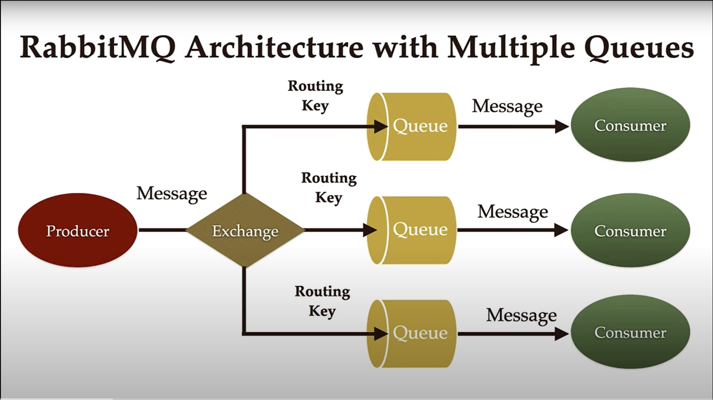

# RabbitMQ Documentation  Brief Explanation

## Utility
RabbitMQ is a message broker that allows applications to communicate by sending and receiving messages in a reliable, scalable, and asynchronous manner.

## Abstraction-Level:
  - **producers & consumer** connect to the broker .
  - **producers** (subscribes to queues) have no clue who the consumers are, they only publish a message via the exchange specifying a routing_key indicating what queues are targeting where the routing_key is usually an exact match or a pattern to a biding_key between the exchange and the queues.
  - **Consumers** have no clue who  the producer(publisher) is, they only subscribe to a queue and queue the messages and acks them after processing them optionally mandatory in some logic cases.

## Key Features and When to Use
- **Queues:** Use when needing to buffer messages between producers and consumers.
- **Exchanges and Bindings:** Use for routing messages based on routing keys and headers.
- **Acknowledgments:** Ensure reliable delivery and processing of messages.
- **Clustering:** Use for high availability and scalability.
- **Plugins (e.g., Shovel, Federation):** Use for integrating with other messaging systems or enhancing functionality.

## Use Cases:
  - [use case examples](USECASES.md)
## Limitations
  - High availability configurations can be complex.
  - Message ordering guarantees can be challenging under certain conditions.
  - Requires understanding of messaging patterns for optimal performance.
  - [examples when u might consider avoiding using rabbitMQ](AVOID_USECASES.md)

## Scaling
RabbitMQ can scale horizontally by adding more nodes to distribute message load.

### Scaling Limitations
- Performance may degrade with very high message throughput.
- Administrative overhead increases with larger clusters.

## Ensuring Queue Consistency and Order
- Use message acknowledgments and persistent queues.
- Minimize message reordering with appropriate consumer handling and message routing strategies.

## Architecture

  

## Components
- **Exchange:** Routes messages to queues based on rules defined by bindings.
- **Queue:** Stores messages.
- **Binding:** Rule that links an exchange to a queue based on message attributes.
- **Connection:** TCP connection between client and broker.
- **Channel:** Multiplexed connection within a connection for efficient message transfer.

## Exchange Types
- **Direct Exchange:(Exactmatching routingKey->boundKey)** Routes messages with a specific routing key to the queues that are bound to it with the same key.
- **Fanout Exchange:(broadcast)** Routes messages to all queues bound to it regardless of routing key.
- **Topic Exchange:(same as Direct only allows support for wild cards # \*)** Routes messages to queues based on pattern matching between the routing key and the pattern specified in the binding.
- **Headers Exchange:(same as Direct)** but Routes messages based on header values instead of routing key.
  ### Exchange Use Cases:
    - [use cases examples](Exchange_UseCases.md)
  ### Exchange-Properties:
    - **Name** 
    - **Type** (direct, fanout, etc.)
    - **Durability** ( talking about topology not messages): Durable (yes/no), Transient (yes/no)
      - *Durable* => Exchange is saved to disk and survives broker restarts.
      - *Transient* => Exchange is not saved and will be lost on broker restart.
    - **Auto-delete** (yes/no)
      - *yes* => Specifies if the exchange is deleted when no longer in use
      - *no* => do not delete even if no longer in use
    - **Internal** (yes/no)
      - *no* (default) => Indicates that the exchange can be used for regular publishing and routing of messages from publishers. also 
      - *yes* =>   restricts the exchange to be used only for internal purposes within RabbitMQ, typically for building more complex routing configurations. cannot be directly published to by producers (publishers).
    - **Arguments** : optional [ key=value , ... ]
      - *Optional* key-value pairs used by plugins and extensions.

## Queue
  - Queues are passive recipients of messages. They store messages until they are consumed by consumers that are bound to them
  - Queues are simpler compared to exchanges, focusing primarily on message storage and delivery to consumers based on binding rules.
  - Queues in RabbitMQ serve as storage areas for messages, providing durability options and settings that control their lifecycle and accessibility. They are essential components for managing message delivery and ensuring reliable message consumption by consumers.
  - ### Queue Properties:
    - **Name**: Identifies the queue within RabbitMQ.
    **Durability**: Durable (yes/no), Transient (yes/no)
      - *Durable*: Queue survives broker restarts if `true`.
      - *Transient*: Queue is lost on broker restart if `true`.
      - **Default**: `Durable: yes`, `Transient: no`
    - **Auto-delete**: yes/no
      - *yes*: Queue is deleted when no longer in use.
      - *no*: Queue remains even if no longer in use.
      - **Default**: `no`

    - **Exclusive**: yes/no
      - *yes*: Queue can only be accessed by the connection that created it.
      - *no*: Queue can be accessed by any connection.
      - **Default**: `no`

    - **Arguments**: Optional [ key=value , ... ]
      - *Optional*: Additional settings for specific queue behaviors.
    - **Optional Parameters**:
      - `x-message-ttl`: Message Time-To-Live (TTL) in milliseconds.
      - `x-dead-letter-exchange`: Name of the exchange to route expired or rejected messages.
      - `x-max-length`: Maximum number of messages in the queue before older messages are discarded.
      - `x-queue-mode`: Queue mode for optimizing memory usage (`lazy` mode for minimizing memory usage).

## Binding 
  - Bindings in RabbitMQ define the rules for routing messages between exchanges and queues within the messaging system.
  - bindings primarily specify the relationship and routing rules between exchanges and queues or between exchanges themselves dictating how messages are routed within RabbitMQ.. 
  - Bindings are crucial for defining how messages flow through RabbitMQ's messaging topology. They provide flexibility in message routing, enabling efficient communication between producers and consumers or between different parts of a distributed system.
  - ### Types of Bindings:
    - #### Queue Bindings
      - Specifies routing keys or patterns to determine which messages from the exchange are routed to the queue.
        - ***Default Bindings***
          - Some exchanges have default bindings to queues if specific bindings are not explicitly defined ==> Ensures basic message routing functionality even without explicit configuration.
    - #### Exchange Bindings:
      - Facilitates message forwarding or fanout behavior, where messages published to one exchange can be routed to multiple exchanges based on specific rules.
    - #### Headers Bindings:
      - Allows for complex routing logic based on header values rather than routing keys.
    - #### Dynamic Binding:
      - Bindings can be dynamically created or modified during runtime in RabbitMQ.
      - Enables flexible and adaptive message routing configurations based on changing application needs.
  - ### Routing Keys and Patterns:
    - Used in queue bindings to filter messages from exchanges based on specific criteria ex: case of topicExchange.
    - Directly influence which messages are routed to which queues based on their routing key values ex: case of direct exchange.
  - ### Binding Properties:
    - **Source Exchange**: Identifies the source exchange from which messages originate.
    - **Destination**: Specifies the destination queue or exchange where messages are routed.
    - **Routing Key/Pattern**: Defines the criteria used to route messages from the source exchange to the destination.
    - **Binding Arguments**: Optional [ key=value , ... ]
    - Additional settings or criteria for specific binding behaviors.
    - 
## Message:
  - Message is  the fundamental unit of data that is exchanged between components within the system, such as between producers (publishers) and consumers (subscribers).
  - They carry payloads of information and metadata necessary for routing and processing within the messaging infrastructure.
  - ### Message Lifecycle
    - **Publishing**: Producers publish messages to exchanges, specifying a routing key and optional headers.
    - **Routing**: Exchanges receive messages and route them to queues based on configured bindings and routing rules.
    - **Queue Storage**: Messages reside in queues until they are consumed by subscribed consumers.
    - **Consumption**: Consumers retrieve messages from queues, process them, and send acknowledgments back to RabbitMQ upon successful processing.

  - ### Message Properties:
    - **Payload**: 
      - The main content of the message being transmitted. It carries the actual data or information that the producer intends to send to consumers.
  
    - **Headers**: 
      - Optional metadata providing additional context or instructions for message processing. Headers can include information that helps with routing decisions or custom processing logic at the consumer end.
  
    - **Routing Key**: 
      - Identifies the routing criteria used by exchanges to determine the destination queues for the message. Messages with matching routing keys are routed to corresponding queues based on exchange bindings.
  
    - **Delivery Mode**: 
      - Specifies whether the message should be persisted (`delivery_mode=2`) or kept in memory (`delivery_mode=1`).
      - *Persistent*: Messages marked as persistent (`delivery_mode=2`) are saved to disk by RabbitMQ. They survive broker restarts and ensure reliable delivery.
      - *Transient*: Messages marked as transient (`delivery_mode=1`) are kept in memory. They are faster but may be lost if the broker restarts before delivering them to consumers.
      - **Default**: RabbitMQ defaults to `Persistent` (`delivery_mode=2`) for message durability unless explicitly set otherwise.
  
    - **Message Properties**: 
      - Additional attributes that provide detailed information about the message. These properties include:
        - *Content Type*: Describes the MIME type of the message payload. Example: `application/json`, `text/plain`, etc.
        - *Content Encoding*: Specifies the encoding format used for the message content. Example: `UTF-8`, `gzip`, `base64`, etc.
        - *Timestamp*: Indicates the time when the message was sent or published. Represented in Unix timestamp format.
        - *Expiration Time*: Specifies how long the message remains valid before it expires and is discarded by RabbitMQ. Expressed in milliseconds from the current time.
  
    - **Acknowledgment**: 
      - Confirms successful message processing by consumers. Acknowledgments ensure that messages are reliably delivered and processed, preventing message loss and ensuring end-to-end message delivery guarantees.

 - ## Persistence and Acknowledgment  (talking about the messages explicitly here )
    - **Persistent Messages:** Ensure messages are stored on disk and survive broker restarts. Achieved by setting the `delivery_mode` to 2 when publishing messages.
  - **Acknowledgments:** Used to confirm message delivery. Consumers send an acknowledgment to RabbitMQ once they have     successfully processed a message.

 - ## Persistent Messages
    - **Definition:** A message marked as persistent is stored on disk by RabbitMQ, ensuring that it survives broker restarts.
    - **Behavior:** When a persistent message is sent to a queue, RabbitMQ writes it to disk. This helps ensure that messages are not lost in case of a broker crash.

 - ## Persistence and Acknowledgment Together
  - **Interaction:** When a message is persistent and a consumer acknowledges it:
    - The message is stored on disk when it is placed in the queue.
    - Once the consumer processes the message and sends an acknowledgment, RabbitMQ can safely delete the message from the queue and   disk storage, knowing that it has been successfully processed.

 - ### Summary
  - **Persistent Messages:** Are not deleted immediately upon queuing; they are stored on disk to survive broker restarts.
  - **Acknowledged Messages:** Are deleted from the queue (and disk if persistent) once the consumer processes them and sends an acknowledgment to RabbitMQ. This ensures message durability until successful processing.

## Channel
A channel is a lightweight connection within a TCP connection to the RabbitMQ broker, allowing for multiple streams of communication without the overhead of multiple TCP connections.

### When Channels Are Needed
- To separate different logical streams of communication within the same connection.
- To handle multiple consumers or producers efficiently within a single application.
- To achieve concurrency in message processing.

### When Channels Are Critical
- When high throughput and low latency are required.
- To avoid TCP connection overhead and limit resource consumption.
- In scenarios where multiple threads or processes need to interact with RabbitMQ simultaneously, each using its own channel.

---

- *Created and maintained by [Seif-Allah Rbaihi]( https://github.com/rbaihis )*  *[Linkdin]( https://www.linkedin.com/in/seif-allah-rbaihi-2b6091126 )*
